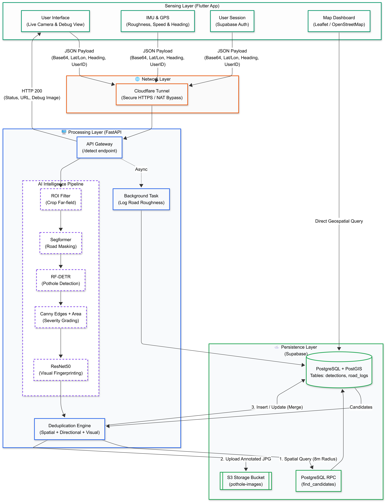

***

# 🛣️ Road Eye: AI-Powered Autonomous Pothole Detection

**Road Sense Pro** is a high-performance, hybrid Edge-Cloud civic technology system. It uses a mobile device for sensor data collection (Video + GPS + IMU) and a tethered PC or Google Colab instance for transformer-based AI processing (**RF-DETR** + **Segformer**), synchronized via Supabase.


## 🌟 Key Features

*   **RF-DETR Transformer Detection:** Uses the state-of-the-art RF-DETR model for superior detection of small and blurry potholes compared to traditional CNNs.
*   **Segformer Road Masking:** Integrates NVIDIA’s Segformer to identify the road surface, ensuring AI only reports potholes physically located on the drivable road.
*   **ROI (Region of Interest) Intelligence:** Implements a dynamic split-line boundary to ignore far-field horizon noise and focus only on the immediate driving path.
*   **Intelligent Deduplication:** Uses **PostGIS** spatial clustering and **ResNet50** visual fingerprinting to merge multiple reports of the same pothole into a single "Master" entry.
*   **Live AI Eye (Debug Mode):** Toggleable debug view in the app to see live segmentation masks, ROI boundaries, and detection boxes in real-time.
*   **Road Roughness Index:** Calculates road vibration statistics (IMU fusion) to log invisible structural damage.
*   **Global Access via Cloudflare:** Securely exposes local AI nodes to the internet with automatic **QR Code generation** for easy mobile pairing.

---

## 🏗️ System Architecture



---

## 🛠️ Prerequisites

1.  **Hardware:**
    *   **Mobile:** Android Device (Android 10+).
    *   **Server:** PC with NVIDIA GPU (T4/30-series+) or **Google Colab (Free T4 tier)**.
2.  **Software:**
    *   [Flutter SDK](https://docs.flutter.dev/get-started/install)
    *   [Python 3.10+](https://www.python.org/downloads/)
    *   [Cloudflared CLI](https://developers.cloudflare.com/cloudflare-one/connections/connect-networks/downloads/)
3.  **Accounts:**
    *   [Supabase](https://supabase.com) (Database + Storage).

---

## 🚀 Setup Guide

### Phase 1: Cloud Database Setup (Supabase)

1.  Create a project at [Supabase.com](https://supabase.com).
2.  In **SQL Editor**, run the sql commands from [supabase-config.sql](https://github.com/astralranger/road-eye/blob/v1.1/supabase-config.sql)

---

### Phase 2: AI Server Setup (Python/Colab)

1.  **Local Setup:** Install the requirements from requirements.txt
2.  **Checkpoint:** Place your `checkpoint_best_ema.pth` in the `best_saved_model/` folder.
3.  **Environment:** Create a `.env` file:
    ```ini
    SUPABASE_URL=your_supabase_url
    SUPABASE_SERVICE_ROLE_KEY=your_service_role_key
    ```
4.  **Run:** `python server.py` (Local) or use the provided Colab Notebook cells for cloud execution.

---

### Phase 3: Mobile App Setup (Flutter)

1.  Update `.env` in the Flutter root with your `SUPABASE_URL` and `SUPABASE_KEY`.
2.  Install dependencies:
    ```bash
    flutter pub get
    ```
3.  Build and Run:
    ```bash
    flutter run
    ```

---

## 🚦 Usage Workflow

### Step 1: Start the Tunnel & Server
If using Colab, run the **Launcher Cell**. It will display a **QR Code**. If local:
```powershell
.\cloudflared.exe tunnel --url http://127.0.0.1:5000
```

### Step 2: Pairing
1.  Open the App.
2.  **Scan the QR Code** displayed in the server terminal/Colab output.
3.  The app will automatically configure the server URL.

### Step 3: Patrol
1.  Click **"START PATROL"**.
2.  The app captures data every 2 seconds.
3.  The server runs the **Segformer mask**, applies the **ROI Split-line**, and executes **RF-DETR**.
4.  Confirmed potholes are scored via **Canny Edge Detection** (Minor/Moderate/Severe).

---

## 🔧 Troubleshooting

| Issue | Solution |
| :--- | :--- |
| **Matrix Mismatch** | The server includes a **Dynamic Interceptor** that auto-patches checkpoints to match the architecture hidden dimensions (256 vs 384). |
| **Location Drift** | App uses `bestForNavigation`. Ensure "High Accuracy" is enabled in Android System Settings. |
| **Broken Images** | Ensure the `pothole-images` storage bucket is set to **Public** in Supabase. |
| **PyTorch 2.6 Error** | The server automatically applies `weights_only=False` to bypass new security restrictions for custom `.pth` files. |

---
