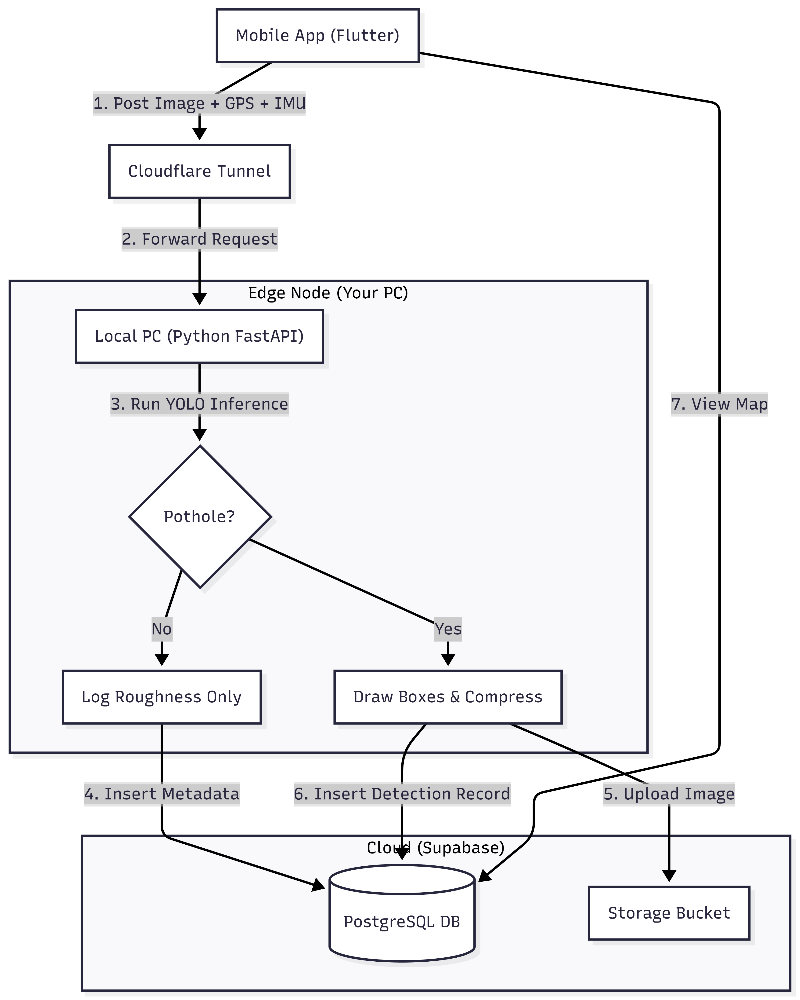

***

# 🛣️ Road Sense Pro: Autonomous Pothole Detection

**Road Sense Pro** is a hybrid Edge-Cloud civic technology system designed to automate road quality monitoring. It uses a mobile device for sensor data collection (Video + GPS + IMU) and a tethered PC for heavy AI processing (YOLOv8), synchronized via the Cloud.


## 🌟 Key Features

*   **Hybrid Edge-Cloud Architecture:** Offloads heavy AI inference to a local PC/Server while the phone handles data capture.
*   **Real-Time Pothole Detection:** Uses YOLOv8 to visually detect potholes from the video stream.
*   **Road Roughness Index:** Uses the phone's Accelerometer (IMU) to calculate road vibration/roughness statistics, logging invisible road damage.
*   **High-Precision GPS:** Implements `bestForNavigation` location tracking for pinpoint accuracy.
*   **Global Access:** Exposes the local AI server to the internet via **Cloudflare Tunnels**, allowing the mobile app to work on 4G/5G anywhere.
*   **Smart Storage:** Saves bandwidth by only uploading confirmed pothole images to the cloud (Supabase Storage).

---

## 🏗️ System Architecture


---

## 🛠️ Prerequisites

1.  **Hardware:**
    *   **Mobile:** Android Device (Android 10+ recommended).
    *   **Server:** PC/Laptop with Python installed (GPU recommended for faster inference).
2.  **Software:**
    *   [Flutter SDK](https://docs.flutter.dev/get-started/install)
    *   [Python 3.9+](https://www.python.org/downloads/)
    *   [Cloudflared CLI](https://developers.cloudflare.com/cloudflare-one/connections/connect-networks/downloads/)
3.  **Accounts:**
    *   [Supabase](https://supabase.com) (Free Tier).

---

## 🚀 Setup Guide

### Phase 1: Cloud Database Setup (Supabase)

1.  Create a new project at [Supabase.com](https://supabase.com).
2.  Go to the **SQL Editor** and run the following script to set up tables and security:

```sql
-- 1. Table for Visual Detections (Red Markers)
create table detections (
  id bigint generated by default as identity primary key,
  created_at timestamp with time zone default timezone('utc'::text, now()) not null,
  latitude float not null,
  longitude float not null,
  image_url text not null,
  severity text default 'Medium',
  pc_node_id text
);

-- 2. Table for Road Telemetry (Roughness Logs)
create table road_logs (
  id bigint generated by default as identity primary key,
  created_at timestamp with time zone default timezone('utc'::text, now()) not null,
  latitude float not null,
  longitude float not null,
  roughness float not null,
  session_id text
);

-- 3. Security Policies (Allow Public Read)
alter table detections enable row level security;
alter table road_logs enable row level security;
create policy "Public Read Detections" on detections for select using (true);
create policy "Public Read Logs" on road_logs for select using (true);
create policy "Public Insert Logs" on road_logs for insert with check (true);
```

3.  Go to **Storage** -> Create a new bucket named **`pothole-images`**.
    *   **IMPORTANT:** Toggle **"Public Bucket"** to ON.
4.  Go to **Project Settings** -> **API**.
    *   Copy the `URL`.
    *   Copy the `anon` (Public) Key.
    *   Copy the `service_role` (Secret) Key.

---

### Phase 2: AI Server Setup (Python)

1.  Navigate to the server directory.
2.  Install dependencies:
    ```bash
    pip install fastapi uvicorn python-dotenv supabase ultralytics opencv-python numpy python-multipart
    ```
3.  Place your trained YOLO model file (e.g., `best.pt`) in the server folder.
4.  Create a `.env` file in the server folder:
    ```ini
    SUPABASE_URL=https://your-project-id.supabase.co
    SUPABASE_SERVICE_ROLE_KEY=your-service-role-secret-key-here
    ```
5.  Run the server:
    ```bash
    python server.py
    ```

---

### Phase 3: Mobile App Setup (Flutter)

1.  Navigate to the app directory.
2.  Create a `.env` file in the root (next to `pubspec.yaml`):
    ```ini
    SUPABASE_URL=https://your-project-id.supabase.co
    SUPABASE_KEY=your-anon-public-key-here
    ```
3.  Install dependencies:
    ```bash
    flutter pub get
    ```
4.  Connect your Android phone via USB.
5.  Run the app:
    ```bash
    flutter run
    ```

---

## 🚦 Usage Workflow (How to run the system)

### Step 1: Expose the Server
We use Cloudflare to make your local Python server accessible from the mobile data network.
Open a terminal on your PC and run:
```powershell
# Ensure port 5000 matches the PORT in server.py
.\cloudflared.exe tunnel --url http://127.0.0.1:5000
```
*Copy the URL generated (e.g., `https://random-name.trycloudflare.com`).*

### Step 2: Start the Brain
Open a new terminal on your PC and run:
```bash
python server.py
```
*Verify it says "🚀 SERVER RUNNING".*

### Step 3: Configure the Mobile App
1.  Open **Road Sense Pro** on your phone.
2.  If it's the first launch, a dialog will appear.
3.  Paste the Cloudflare URL (from Step 1) into the box.
    *   *Example:* `cool-app.trycloudflare.com`
4.  Click **Save**.

### Step 4: Start Patrol
1.  Mount the phone on your car dashboard/windshield.
2.  Click **"START PATROL"**.
3.  **Drive!**
    *   The app will automatically upload images every 2 seconds.
    *   The PC will process them.
    *   If a pothole is found, it saves to the map.
    *   Road roughness is logged continuously.

### Step 5: Visualization
1.  Click the **Map Icon** in the app's top bar.
2.  View all confirmed potholes detected by your AI.
3.  Tap a marker to see the evidence photo.

---

## 🔧 Troubleshooting

| Issue | Solution |
| :--- | :--- |
| **Cloudflared Error:** `connection refused` | Ensure `server.py` is running *before* or concurrently. Ensure you are tunneling to `127.0.0.1:5000`. |
| **App Error:** `Connection Timed Out` | Check if the Cloudflare URL changed (it changes every time you restart the tunnel unless you pay). Update it in the App Settings. |
| **Supabase Error:** `row-level security` | Ensure you used the `SERVICE_ROLE_KEY` in `server.py` and the `ANON_KEY` in Flutter. |
| **Map Images Broken** | Ensure the `pothole-images` bucket is set to **Public** in Supabase dashboard. |

---
