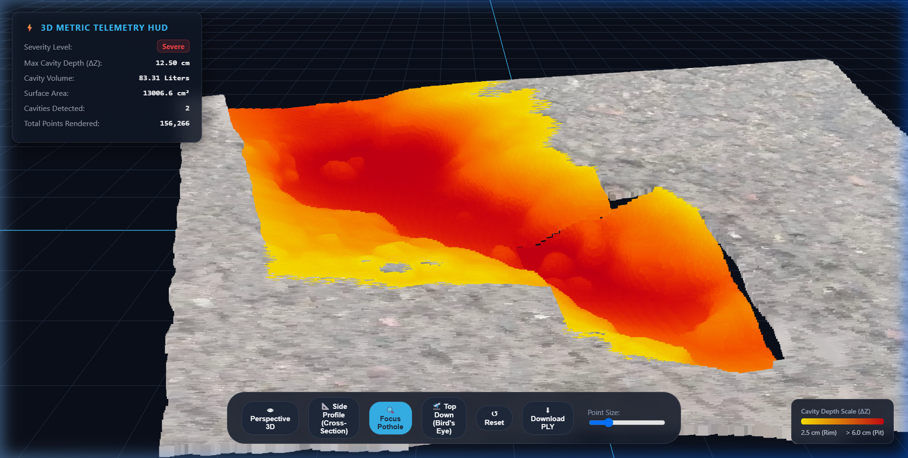
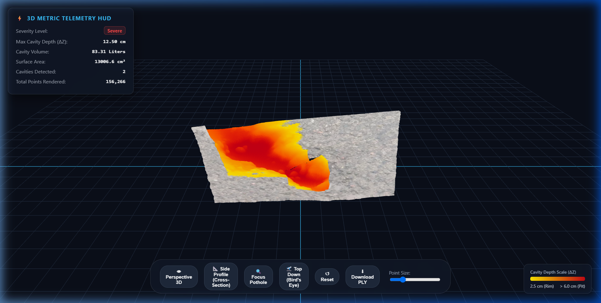
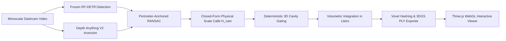

# 🛣️ RoadEye: Autonomous 3D Road Defect & Pothole Reconstruction Engine

<div align="center">

[](https://www.python.org/)
[](https://flutter.dev/)
[](https://pytorch.org/)
[](https://threejs.org/)
[](https://fastapi.tiangolo.com/)
[](https://supabase.com/)
[](LICENSE)

**An end-to-end, zero-retraining edge-to-cloud platform for monocular dashcam video analysis, deterministic 3D metric road reconstruction, 3D Gaussian Splatting, and automated civic infrastructure telemetry.**

[🌟 3D Splatting Outputs](#-3d-gaussian-splatting-reconstruction-output) •
[📐 Mathematical Foundations](#-mathematical-formulation--methodology) •
[📱 Mobile App](#-flutter-mobile-application-road_data_logger) •
[⚡ Backend Server](#-intelligent-backend-server) •
[🚀 Quickstart](#-quickstart--execution)

</div>

---

## 🌟 3D Gaussian Splatting Reconstruction Output

RoadEye converts standard monocular dashcam video (`.mp4`) into true-scale metric 3D road surfaces and anisotropic 3D Gaussian Splats with millimeter-level cavity profiling.

### Interactive 3D Visualizer & Heatmap Profiling

<div align="center">
  
  <p><em>Figure 1: Close-up perspective rendering of a severe road cavity. Monocular depth disparity is inverted into metric coordinates, fitted with perimeter-anchored RANSAC, and rendered with thermal depth heatmap coloring.</em></p>
</div>

<div align="center">
  
  <p><em>Figure 2: Complete Three.js WebGL inspection canvas featuring live 3D Metric Telemetry HUD, camera cross-section toggles, and direct PLY download.</em></p>
</div>

### Real Volumetric Telemetry Captured

| Telemetry Parameter | Value | Description |
|---|---|---|
| **Max Cavity Depth ($\Delta Z$)** | **$12.50\,\text{cm}$** | Peak depression below perimeter road baseline |
| **Integrated Cavity Volume** | **$83.31\,\text{Liters}$** | Exact volumetric asphalt deficit for repair material estimation |
| **Total Surface Area** | **$13,006.6\,\text{cm}^2$** | Projected horizontal bounding footprint of damaged pavement |
| **Cavities Segmented** | **$2$** | Individual disjoint depressions identified in the ROI |
| **Total Gaussian Splats** | **$156,266$** | Surface-normal aligned anisotropic ellipsoids rendered in 60 FPS WebGL |
| **Severity Classification** | <span style="color:#ef4444;font-weight:bold;">CRITICAL / SEVERE</span> | Triggered automatically when $\Delta Z > 6.0\,\text{cm}$ or $V > 15\,\text{L}$ |

> **Interactive 3D Experience:** To inspect the real-time reconstruction directly in your browser without compiling any C++ or CUDA code, open `reconstruction_outputs/0002_3d_viewer.html` in Chrome, Firefox, or Edge.

---

## 📐 Mathematical Formulation & Methodology


```mermaid
flowchart LR
    A[Monocular Dashcam Video] --> B[Frozen RF-DETR Detection]
    A --> C[Depth Anything V2 Inversion]
    B & C --> D[Perimeter-Anchored RANSAC]
    D --> E[Closed-Form Physical Scale Calib H_cam]
    E --> F[Deterministic 3D Cavity Gating]
    F --> G[Volumetric Integration in Liters]
    G --> H[Voxel Hashing & 3DGS PLY Exporter]
    H --> I[Three.js WebGL Interactive Viewer]
```

### 1. Disparity to Cartesian Distance Inversion
Affine-invariant relative disparity $d \in [0, 1]$ exhibits non-linear inverse perspective compression. We invert normalized disparity into projective Cartesian distance:
$$d_{\text{norm}} = \frac{d - d_{\min}}{d_{\max} - d_{\min} + \epsilon}$$
$$Z_{\text{rel}} = \frac{1.0}{0.9 \cdot d_{\text{norm}} + 0.07}$$
$$X = \frac{(u - c_x) \cdot Z}{f_x}, \quad Y = -\frac{(v - c_y) \cdot Z}{f_y}$$
This formulation eliminates monocular "funnel" pinching artifacts and restores true planar road geometry.

### 2. Perimeter-Anchored RANSAC Plane Fitting
Cavity depressions inherently corrupt standard least-squares and global RANSAC ground plane fits. RoadEye isolates an outer **10%–12% margin band** surrounding the detection bounding box:
$$\text{Margin Mask} = \text{BBox}_{\text{dilated}} \setminus \text{BBox}_{\text{interior}}$$
We solve for the reference ground plane $aX + bY - Z + c = 0$ exclusively over clean asphalt margin points, guaranteeing immunity against cavity depth bias.

### 3. Absolute Metric Scale Factor via Physical Height $H_{\text{cam}}$
Monocular scale ambiguity is resolved without ground control points using the vehicle's fixed optical center mounting height $H_{\text{cam}}$ ($1.35\,\text{m}$ nominal):
$$D_{\text{rel}} = \frac{|c|}{\sqrt{a^2 + b^2 + 1}}$$
$$s = \frac{H_{\text{cam}}}{D_{\text{rel}}}, \quad \mathbf{P}_{\text{metric}} = s \cdot \mathbf{P}_{\text{rel}}$$

### 4. Deterministic 3D Cavity Gating
Shadows, road patches, and painted manholes frequently cause 2D false positives. RoadEye enforces physical geometric gating:
$$\text{If } \max(\Delta Z) < 2.5\,\text{cm} \quad \text{OR} \quad \text{Area} < 50\,\text{px} \implies \text{REJECT (2D Artefact)}$$

### 5. Volumetric Cavity Integration
For all valid cavity pixels $(u, v)$ where $\Delta Z(u, v) = \max(0, Z_{\text{baseline}} - Z) > 0$:
$$dA(u, v) = \left(\frac{Z(u, v)}{f_x}\right) \cdot \left(\frac{Z(u, v)}{f_y}\right) \quad [\text{m}^2]$$
$$V_{\text{liters}} = \sum_{(u, v) \in \text{cavity}} \Delta Z(u, v) \cdot dA(u, v) \times 1000 \quad [\text{Liters}]$$

### 6. Standard 3D Gaussian Splats Format (3DGS)
The pipeline generates binary and ASCII `.ply` files containing 3D Gaussian ellipsoids:
- **Road Splats:** Tangent-aligned anisotropic disks ($s_{\parallel} \approx 2.5\,\text{cm}, s_{\perp} \approx 0.5\,\text{cm}$) oriented with ground plane unit normal $\mathbf{n}$.
- **Cavity Splats:** Isotropic splats ($s \approx 1.0\,\text{cm}$) mapped to high-contrast thermal gradients for visual inspection.

---

## 📱 Flutter Mobile Application (`road_data_logger`)

A modern mobile client providing field telemetry, GPS tracking, and edge capture:

* **Production Clean Architecture:** Strict separation between presentation screens, telemetry services, domain models, and application configuration.
* **Uber Clean Dark Theme:** High-contrast tactical dashboard designed for vehicle dashboard mounting.
* **Circular Telemetry Ring Buffer:** Real-time IMU acceleration buffer detecting sudden vertical G-force spikes.
* **Interactive OpenStreetMap Integration:** Live defect marker map with cluster inspection and server sync.
* **Automated Unit & Widget Tests:** Full test suite verifying telemetry payloads, URL encoding, ring buffers, and widget rendering.

---

## ⚡ Intelligent Backend Server

The backend microservice provides edge ingestion, AI inference, and deduplication:

* **Dynamic Shape Interpolator:** Handles varying ViT patch embedding resolutions seamlessly across PyTorch versions without requiring model recompilation.
* **Cosine Spatio-Temporal Deduplication:** Embeds image patches using a Vision Transformer (ViT) and computes spatial distance + cosine similarity against recent records, preventing duplicate civic work tickets.
* **Supabase Cloud Sync:** Direct ingestion into Postgres with PostGIS geo-coordinates, automated ride session tracking, and image storage.
* **Civic Authority Dispatch:** Automated SMTP email reporting with defect imagery, geo-location, and volumetric severity metrics.

---

## 📁 Repository Structure

```
road-eye/
├── .gitignore                     # Production ignore rules (secrets, weights >100MB, venv)
├── .env.example                   # Sanitized configuration template
├── README.md                      # Complete system documentation & outputs
├── requirements.txt               # Pinned Python dependencies
│
├── Depth/                         # 3D Gaussian Splatting & Geometric Engine
│   ├── config.py                  # Pipeline, Camera, RANSAC, & Splat dataclasses
│   ├── depth_engine.py            # Disparity inversion & perimeter RANSAC
│   ├── detector.py                # Frozen RF-DETR adapter
│   ├── fusion.py                  # 2cm Voxel hash deduplication & 3DGS PLY synthesizer
│   ├── geometry.py                # 3D cavity gating & volumetric integration
│   ├── odometry.py                # 6-DoF visual odometry scale propagation
│   ├── pipeline.py                # End-to-end video pipeline orchestrator
│   ├── run_pipeline.py            # CLI entry point
│   ├── test_depth_modules.py      # Automated module verification test suite
│   ├── viewer.py                  # Three.js WebGL standalone HTML generator
│   └── README.md                  # Depth engine detailed guide
│
├── reconstruction_outputs/        # 3D Reconstruction demonstration artifacts
│   ├── 0002_3d_viewer.html        # Self-contained interactive Three.js 3D viewer
│   ├── 0002_telemetry.json        # Metric volumetric telemetry output
│   └── assets/                    # High-res renders of 3D Splatting outputs
│       ├── pothole_gaussian_splat_focus.png
│       ├── pothole_3d_viewer_hud.png
│       └── yoloflow-architecture.png
│
├── server/                        # Backend inference & ingestion services
│   ├── intelligent_server.py      # FastAPI server with ViT cosine deduplication
│   ├── server.py                  # Telemetry server with automated email alerts
│   ├── feature_extractor.py       # ViT patch feature extractor
│   ├── cleanup.py                 # Database maintenance and pruning utility
│   ├── depth_anything_v3.py       # Monocular depth model interface
│   └── supabase_delete_fix.sql    # Database schema definitions & SQL policies
│
└── road_data_logger/              # Flutter mobile data logging application
    ├── pubspec.yaml               # Flutter package configuration
    ├── lib/                       # Clean architecture app code
    ├── test/                      # Unit and widget test suite
    ├── android/                   # Android native platform configuration
    └── ios/                       # iOS native platform configuration
```

---

## 🚀 Quickstart & Execution

### 1. Python Environment Setup
```bash
# Clone and enter the repository
git clone https://github.com/astralranger/road-eye.git -b gaussian-splat
cd road-eye

# Create and activate virtual environment
python -m venv venv
# On Windows:
.\venv\Scripts\activate
# On Linux/macOS:
source venv/bin/activate

# Install dependencies
pip install -r requirements.txt
```

### 2. Run 3D Gaussian Splatting Pipeline
```bash
# Execute on a dashcam video
python Depth/run_pipeline.py --video "path/to/dashcam.mp4" --h_cam 1.35 --output_dir "outputs"

# Run self-contained synthetic verification test
python Depth/run_pipeline.py --demo --output_dir "demo_outputs"
```

### 3. Open Interactive 3D WebGL Viewer
Simply double click or open the generated HTML file in any modern web browser:
```bash
# On Windows
start reconstruction_outputs/0002_3d_viewer.html

# On macOS
open reconstruction_outputs/0002_3d_viewer.html
```

### 4. Start Intelligent Backend Server
```bash
# Configure environment
cp .env.example .env
# Edit .env with your Supabase credentials

# Launch FastAPI server with Uvicorn
uvicorn server.intelligent_server:app --host 0.0.0.0 --port 8000 --reload
```

### 5. Run Flutter Mobile Application
```bash
cd road_data_logger
flutter pub get
flutter test
flutter run
```

---

## 🛡️ Security & Best Practices

- **Zero Hard-Coded Credentials:** All Supabase URLs, service keys, and SMTP credentials are externalized via environment variables.
- **Model Checkpoint Management:** Large deep learning models (`>100MB`) and raw video datasets are excluded from Git commits via `.gitignore`. Checkpoints are retrieved dynamically or hosted on external model registries.
- **Sanitized Data Pipelines:** All external telemetry uploads undergo strict Pydantic model validation and bounding box sanity checks before database insertion.

---

## 👥 Contributors & Acknowledgements

* **Astral Ranger Team** — Autonomous Camera & Computer Vision Research
* **Depth Anything V2** & **RF-DETR** — Foundation model architectures
* **Three.js** — High-performance browser WebGL rendering
