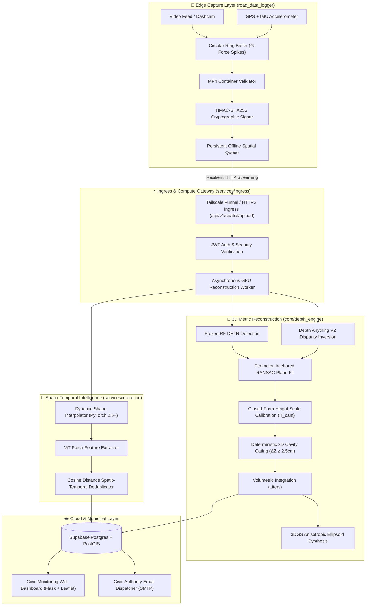

# 🛣️ RoadEye: Edge-to-Cloud Civic Intelligence & 3D Road Defect Reconstruction Platform

<div align="center">

[](https://www.python.org/)
[](https://flutter.dev/)
[](https://pytorch.org/)
[](https://threejs.org/)
[](https://fastapi.tiangolo.com/)
[](https://tailscale.com/)
[](https://supabase.com/)
[](LICENSE)

**An enterprise-grade, zero-retraining platform uniting mobile spatial video logging, real-time transformer detection (RF-DETR), spatio-temporal deduplication, Tailscale Funnel ingress, and zero-retraining 3D Gaussian Splatting with interactive civic dashboards.**

[🌟 3D Splatting Showcase](#-3d-gaussian-splatting-reconstruction-showcase) •
[🏗️ Architecture](#️-system-architecture) •
[📐 Mathematical Foundations](#-mathematical-formulation) •
[📁 Repository Domains](#-domain-architecture--repository-structure) •
[📱 Mobile App](#-mobile-telemetry-app-road_data_logger) •
[⚡ Backend & Ingress](#-backend-services--tailscale-ingress) •
[🚀 Quickstart](#-quickstart--execution)

</div>

---

## 🌟 3D Gaussian Splatting Reconstruction Showcase

RoadEye converts standard monocular dashcam video into millimeter-accurate metric 3D road models and anisotropic 3D Gaussian Splats with real-time volumetric cavity quantification.

### Perspective Inspection & 3D Thermal Heatmaps

<div align="center">
  
  <p><em>Figure 1: Close-up perspective rendering of a reconstructed road cavity. Monocular disparity is inverted into metric coordinates, ground-referenced via perimeter RANSAC, and colored with depth heatmap gradients.</em></p>
</div>

<div align="center">
  
  <p><em>Figure 2: Standalone Three.js WebGL inspection canvas featuring live 3D Metric Telemetry HUD, camera cross-section toggles, and direct PLY point cloud export.</em></p>
</div>

### Metric Telemetry Quantified

| Telemetry Parameter | Value | Engineering Significance |
|---|---|---|
| **Max Cavity Depth ($\Delta Z$)** | **$12.50\,\text{cm}$** | Peak pavement depression below perimeter baseline |
| **Integrated Cavity Volume** | **$83.31\,\text{Liters}$** | Exact volumetric asphalt deficit for municipal repair estimation |
| **Pavement Surface Area** | **$13,006.6\,\text{cm}^2$** | Projected horizontal bounding footprint of damaged surface |
| **Segmented Cavities** | **$2$** | Independent cavity depressions isolated in ROI |
| **Gaussian Splats Synthesized** | **$156,266$** | Surface-normal aligned anisotropic ellipsoids rendered in 60 FPS WebGL |
| **Severity Classification** | <span style="color:#ef4444;font-weight:bold;">CRITICAL / SEVERE</span> | Triggered automatically when $\Delta Z > 6.0\,\text{cm}$ or $V > 15\,\text{L}$ |

---

## 🏗️ System Architecture


```mermaid
flowchart TB
    subgraph MobileEdge["📱 Edge Capture Layer (road_data_logger)"]
        Cam["Video Feed / Dashcam"]
        Sensors["GPS + IMU Accelerometer"]
        RingBuf["Circular Ring Buffer (G-Force Spikes)"]
        Validator["MP4 Container Validator"]
        Signer["HMAC-SHA256 Cryptographic Signer"]
        Queue["Persistent Offline Spatial Queue"]
        
        Cam & Sensors --> RingBuf
        RingBuf --> Validator --> Signer --> Queue
    end

    subgraph IngressGateway["⚡ Ingress & Compute Gateway (services/ingress)"]
        Funnel["Tailscale Funnel / HTTPS Ingress (/api/v1/spatial/upload)"]
        AuthJWT["JWT Auth & Security Verification"]
        AsyncWorker["Asynchronous GPU Reconstruction Worker"]
        
        Queue -->|Resilient HTTP Streaming| Funnel
        Funnel --> AuthJWT --> AsyncWorker
    end

    subgraph CoreEngine["🔬 3D Metric Reconstruction (core/depth_engine)"]
        RFDETR["Frozen RF-DETR Detection"]
        DepthAnything["Depth Anything V2 Disparity Inversion"]
        RANSAC["Perimeter-Anchored RANSAC Plane Fit"]
        ScaleCalib["Closed-Form Height Scale Calibration (H_cam)"]
        Gate["Deterministic 3D Cavity Gating (ΔZ ≥ 2.5cm)"]
        VolumeInt["Volumetric Integration (Liters)"]
        Splat3D["3DGS Anisotropic Ellipsoid Synthesis"]
        
        AsyncWorker --> RFDETR & DepthAnything
        RFDETR & DepthAnything --> RANSAC --> ScaleCalib --> Gate --> VolumeInt --> Splat3D
    end

    subgraph InferenceBackend["🧠 Spatio-Temporal Intelligence (services/inference)"]
        DynShape["Dynamic Shape Interpolator (PyTorch 2.6+)"]
        ViTExtract["ViT Patch Feature Extractor"]
        Deduplicator["Cosine Distance Spatio-Temporal Deduplicator"]
        
        AsyncWorker --> DynShape --> ViTExtract --> Deduplicator
    end

    subgraph DataPlane["☁️ Cloud & Municipal Layer"]
        Supabase[("Supabase Postgres + PostGIS")]
        WebDash["Civic Monitoring Web Dashboard (Flask + Leaflet)"]
        Alerts["Civic Authority Email Dispatcher (SMTP)"]
        
        Deduplicator & VolumeInt --> Supabase
        Supabase --> WebDash & Alerts
    end
```

---

## 📐 Mathematical Formulation

### 1. Disparity to Cartesian Distance Inversion
Monocular depth networks output affine-invariant relative disparity $d \in [0, 1]$ with inverse perspective distortion. We invert normalized disparity into projective Cartesian distance:
$$d_{\text{norm}} = \frac{d - d_{\min}}{d_{\max} - d_{\min} + \epsilon}$$
$$Z_{\text{rel}} = \frac{1.0}{0.9 \cdot d_{\text{norm}} + 0.07}$$
$$X = \frac{(u - c_x) \cdot Z}{f_x}, \quad Y = -\frac{(v - c_y) \cdot Z}{f_y}$$
This formulation rectifies monocular "funnel" pinching artifacts and restores true Cartesian road surfaces.

### 2. Perimeter-Anchored RANSAC Ground Plane Calibration
Pothole depressions bias global planar regression. RoadEye isolates an outer **10%–12% margin band** surrounding the detection ROI:
$$\text{Margin Mask} = \text{BBox}_{\text{dilated}} \setminus \text{BBox}_{\text{interior}}$$
Ground plane equation $aX + bY - Z + c = 0$ is solved exclusively over undamaged asphalt margin points. Absolute metric scale $s$ is calibrated from optical center mounting height $H_{\text{cam}}$ ($1.35\,\text{m}$ nominal):
$$D_{\text{rel}} = \frac{|c|}{\sqrt{a^2 + b^2 + 1}}$$
$$s = \frac{H_{\text{cam}}}{D_{\text{rel}}}, \quad \mathbf{P}_{\text{metric}} = s \cdot \mathbf{P}_{\text{rel}}$$

### 3. Deterministic 3D Cavity Gating
Shadows, oil stains, and painted manholes cause 2D detection false alarms. RoadEye enforces physical geometric gating:
$$\text{If } \max(\Delta Z) < 2.5\,\text{cm} \quad \text{OR} \quad \text{Area} < 50\,\text{px} \implies \text{REJECT (2D Surface Artefact)}$$

### 4. Volumetric Cavity Integration in Liters
For every valid depression pixel $(u, v)$ where $\Delta Z(u, v) = \max(0, Z_{\text{baseline}} - Z) > 0$:
$$dA(u, v) = \left(\frac{Z(u, v)}{f_x}\right) \cdot \left(\frac{Z(u, v)}{f_y}\right) \quad [\text{m}^2]$$
$$V_{\text{liters}} = \sum_{(u, v) \in \text{cavity}} \Delta Z(u, v) \cdot dA(u, v) \times 1000 \quad [\text{Liters}]$$

### 5. 3D Gaussian Splats Format (3DGS)
- **Road Splats:** Tangent-aligned anisotropic disks ($s_{\parallel} \approx 2.5\,\text{cm}, s_{\perp} \approx 0.5\,\text{cm}$) aligned with surface unit normal $\mathbf{n}$.
- **Cavity Splats:** Isotropic splats ($s \approx 1.0\,\text{cm}$) mapped to thermal color gradients for rapid visual triage.

---

## 📁 Domain Architecture & Repository Structure

The repository is strictly structured into clear, decoupled domains:

```text
road-eye/
├── road_data_logger/              # Production Flutter Mobile Application (intact hierarchy)
│   ├── android/                   # Native Android manifest & build configs
│   ├── ios/                       # Native iOS runner & permissions (Info.plist)
│   ├── lib/
│   │   ├── config/                # Environment & session configuration
│   │   ├── models/                # DetectionRecord, SpatialVideoReport, TelemetryPayload
│   │   ├── screens/               # AccountScreen, AuthScreen, DataCollectorView, MapScreen
│   │   ├── services/              # ApiService, CameraService, ResilientHttpClient, SpatialQueueService
│   │   ├── theme/                 # Uber-clean dark theme design tokens
│   │   └── utils/                 # Mp4Validator, RingBuffer, UrlHelper, UuidHelper
│   ├── test/                      # Unit & widget test suites
│   └── pubspec.yaml               # Flutter package configuration
│
├── core/                          # Core Algorithmic & Computer Vision Engines
│   └── depth_engine/              # Monocular 3D Gaussian Splatting & Geometric Reconstruction
│       ├── config.py              # Camera, Depth, RANSAC, Gating, Splat dataclasses
│       ├── depth_engine.py        # Disparity inversion & perimeter RANSAC
│       ├── detector.py            # Frozen RF-DETR detection adapter
│       ├── fusion.py              # 2cm Voxel hash deduplication & 3DGS PLY synthesizer
│       ├── geometry.py            # Deterministic 3D cavity gating & volumetric integration
│       ├── odometry.py            # 6-DoF visual odometry & scale propagation
│       ├── pipeline.py            # End-to-end video pipeline orchestrator
│       ├── run_pipeline.py        # CLI entry point
│       ├── test_depth_modules.py  # Module verification test suite
│       └── viewer.py              # Three.js WebGL standalone HTML generator
│
├── services/                      # Backend & Edge Services
│   ├── ingress/                   # Tailscale Funnel Ingress Gateway
│   │   ├── funnel_ingress.py      # FastAPI edge gateway, JWT auth, async worker dispatch
│   │   └── test_funnel_endpoints.py # Integration test suite for upload endpoints
│   ├── inference/                 # AI Inference & Spatial Deduplication Server
│   │   ├── intelligent_server.py  # FastAPI server with ViT cosine deduplication
│   │   ├── feature_extractor.py   # Vision Transformer (ViT) patch feature extractor
│   │   ├── depth_anything_v3.py   # Monocular depth model interface
│   │   └── cleanup.py             # Database maintenance and pruning utility
│   ├── dashboard/                 # Civic Web Monitoring Dashboard
│   │   ├── app.py                 # Flask web dashboard application
│   │   ├── supabase_client.py     # Supabase client wrapper
│   │   ├── static/                # CSS, map JavaScript, Leaflet vendor bundle
│   │   └── templates/             # Jinja2 HTML templates (dashboard, complaints, map, rides)
│   └── alerts/                    # Municipal Alerts & Notifications
│       ├── email_service.py       # Civic authority SMTP dispatcher
│       └── server.py              # Telemetry & notification server
│
├── database/                      # SQL Schemas & Database Policies
│   ├── schema.sql                 # Base Supabase schema (rides, detections, PostGIS spatial index)
│   └── migrations/
│       └── 001_delete_fix.sql     # Foreign key constraints & delete cascade policies
│
├── docs/                          # Documentation & Visual Assets
│   └── assets/                    # High-res 3D splat renders & architecture diagrams
│
├── .env.example                   # Sanitized configuration template
├── .gitignore                     # Production Git ignore rules
├── requirements.txt               # Unified Python dependency specification
└── README.md                      # Comprehensive project documentation
```

---

## 📱 Mobile Telemetry App (`road_data_logger`)

A hardened mobile client engineered for continuous vehicular patrol capture:

* **Tactical Dark Theme:** High-contrast, driver-friendly UI designed for vehicle mounts.
* **Circular Ring Buffer:** Real-time IMU acceleration buffer detecting sudden vertical G-force anomalies.
* **MP4 Box Validator:** In-memory binary parser validating `ftyp`, `moov`, and `mdat` container headers before network dispatch.
* **Resilient HTTP Streaming:** Streaming multipart uploads with exponential backoff and jitter retry policies.
* **Persistent Offline Queue:** `SharedPreferences`-backed FIFO queue ensuring zero data loss during network drops.
* **Cryptographic Signing:** HMAC-SHA256 telemetry authentication and anti-spoof GPS trajectory validation.
* **Account & Node Diagnostics:** Built-in latency pinging to the Tailscale Funnel / GPU compute node.

---

## ⚡ Backend Services & Tailscale Ingress

### 1. Ingress Service (`services/ingress/funnel_ingress.py`)
* Receives spatial video and sensor metadata over local LAN or Tailscale Funnel (`https://starship...ts.net/api/v1/spatial/upload`).
* Verifies Supabase JWT tokens.
* Enqueues background 3D reconstruction tasks executed by `core/depth_engine/pipeline.py`.
* Serves WebGL viewers and point clouds directly to civic inspectors.

### 2. Spatio-Temporal Deduplication (`services/inference/intelligent_server.py`)
* **Dynamic Shape Interpolator:** Handles variable ViT patch embedding resolutions across PyTorch versions without recompilation.
* **Cosine Spatial Deduplication:** Compares incoming patch visual embeddings and PostGIS coordinates against existing complaints to eliminate duplicate municipal tickets.

### 3. Civic Web Dashboard (`services/dashboard/app.py`)
* Interactive Leaflet map displaying real-time road hazard coordinates and severity levels.
* Audit ledger of rides, pothole reports, repair status, and photo evidence.

---

## 🚀 Quickstart & Execution

### 1. Environment Setup
```bash
# Clone the repository
git clone https://github.com/astralranger/road-eye.git
cd road-eye

# Create and activate Python virtual environment
python -m venv venv
# On Windows:
.\venv\Scripts\activate
# On Linux/macOS:
source venv/bin/activate

# Install unified dependencies
pip install -r requirements.txt

# Configure environment variables
cp .env.example .env
# Edit .env with your Supabase keys and database credentials
```

### 2. Launch Ingress & 3D Processing Gateway
```bash
# Start Tailscale Funnel Ingress Service on port 8000
uvicorn services.ingress.funnel_ingress:app --host 0.0.0.0 --port 8000 --reload
```

### 3. Run Standalone 3D Gaussian Splatting Pipeline
```bash
# Process a monocular dashcam video
python core/depth_engine/run_pipeline.py --video "path/to/dashcam.mp4" --h_cam 1.35 --output_dir "outputs"

# Run self-contained synthetic verification demo
python core/depth_engine/run_pipeline.py --demo --output_dir "demo_outputs"
```

### 4. Start Civic Web Dashboard
```bash
# Launch Flask municipal monitoring portal on port 5000
python services/dashboard/app.py
```

### 5. Launch Flutter Mobile Application
```bash
cd road_data_logger
flutter pub get
flutter test
flutter run
```

---

## 🛡️ Security, Privacy & Enterprise Standards

* **Zero Hardcoded Secrets:** All Supabase URLs, service keys, and SMTP passwords are read strictly from environment variables.
* **Git Cleanliness:** Model weights (`*.pth`, `*.pt >100MB`), video datasets, binary executables, and reconstruction dumps are excluded from version control via `.gitignore`.
* **Tamper-Evident GPS Breadcrumbs:** Mobile logs are cryptographically signed before transmission.

---

## 👥 Contributors & Acknowledgements

* **Astral Ranger Team** — Autonomous Camera & Computer Vision Research
* **Depth Anything V2** & **RF-DETR** — Monocular depth and transformer vision foundations
* **Three.js** — WebGL 3D point cloud & Gaussian Splatting rendering
