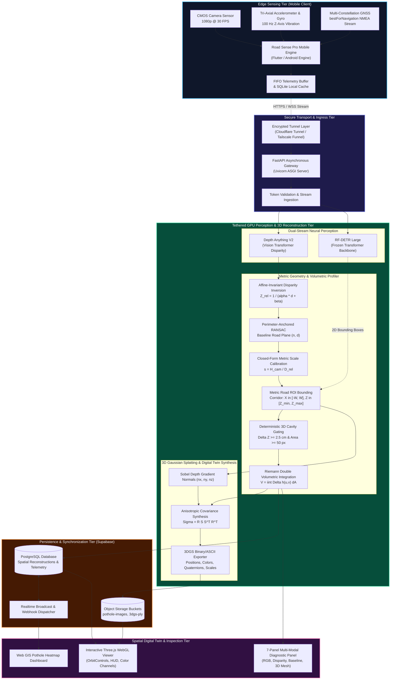
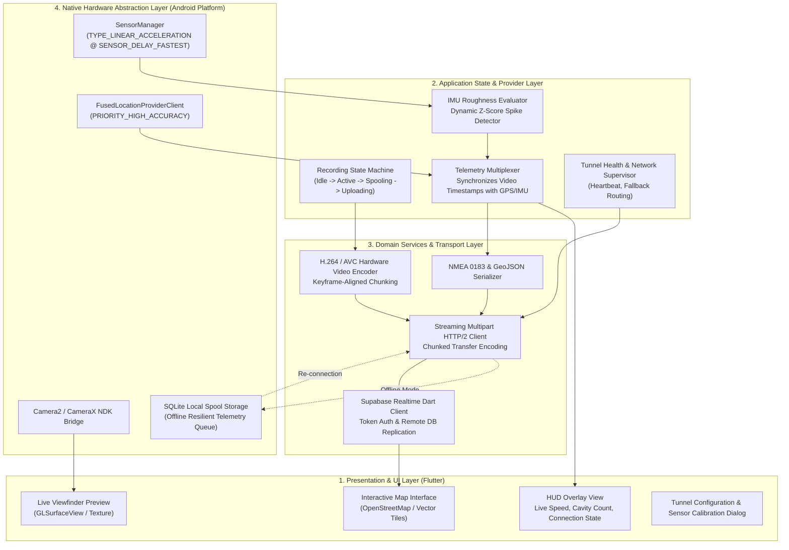
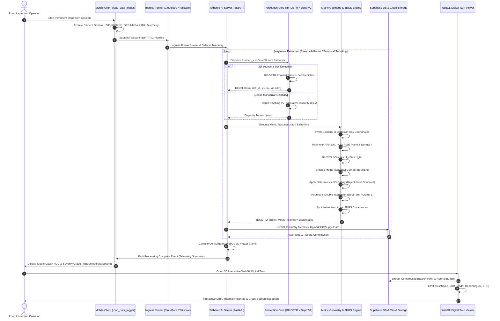

# System Architecture: Road Sense Pro
## An Edge-Cloud Cyber-Physical System for High-Fidelity 3D Pothole Metric Quantification via Monocular Vision Transformers, RF-DETR, and 3D Gaussian Splatting

---

### Abstract
This document provides the formal architectural specification of **Road Sense Pro**, an edge-cloud cyber-physical system designed for real-time pavement distress detection, geometric depth unprojection, and volumetric cavity quantification. Road Sense Pro addresses the severe geometric distortion, scale ambiguity, and high computational footprint inherent in monocular road inspection by introducing a **Zero-Retraining Pruned Cascade**. The pipeline synthesizes lightweight mobile edge telemetry (visual frames, high-precision GNSS, and tri-axial IMU accelerometry) with cloud-tethered deep perception models: a frozen **RF-DETR (Real-Time Detection Transformer)** for 2D spatial gating, and **Depth Anything V2** for monocular relative disparity estimation. Metric scale is recovered in closed form using physical camera mounting height $H_{\text{cam}}$ coupled with a perimeter-anchored RANSAC ground plane estimator. Reconstructed surfaces are synthesized into anisotropic **3D Gaussian Splats (3DGS)** and rendered via a custom WebGL digital twin viewer.

---

## 1. Overall End-to-End System Architecture

The overall system architecture is partitioned across four primary tiers:
1. **Edge Acquisition Tier (Mobile Client)**: Continuously records stabilized video, multi-constellation GNSS trajectories, and high-frequency inertial telemetry.
2. **Ingress & Transport Tier**: Encrypted, low-latency tunneling connecting field devices over cellular networks (4G/5G) to on-premise or cloud GPU nodes.
3. **Deep Perception & Geometric Engine Tier**: Dual-stream perception combining transformer-based object detection, relative disparity estimation, closed-form metric scaling, and volumetric cavity profiling.
4. **Digital Twin & Persistence Tier**: Cloud relational synchronization, storage of 3D Gaussian Splatting (.ply) assets, and multi-modal client-side interactive inspection.

---

## 2. Mobile Edge Application Architecture (`road_data_logger`)

The mobile client is engineered as a zero-latency telemetry logger built upon Flutter and modern Android Native Services. It enforces strict separation of concerns through an event-driven, reactive Clean Architecture pattern.

### Key Mobile Subsystems:
1. **Sensor Acquisition Pipeline**:
   - `Camera2 API` interface delivering high-resolution uncompressed video frames.
   - High-precision GNSS positioning utilizing `bestForNavigation` location requests with sub-meter coordinate updates.
   - Inertial Measurement Unit (IMU) sampling tri-axial linear acceleration ($\alpha_x, \alpha_y, \alpha_z$) at $100\,\text{Hz}$ to compute the **Road Roughness Index (RRI)** via high-pass dynamic filtering:
     $$\text{RRI}(t) = \sqrt{\frac{1}{W} \sum_{k=t-W}^{t} (\alpha_{z, k} - \bar{\alpha}_z)^2}$$
2. **State & Connection Lifecycle Manager**:
   - Maintains continuous ping status across Tailscale / Cloudflare tunnel connections.
   - Automatically fallbacks to local persistent SQLite spooling when traversing cellular blackouts.

---

## 3. RF-DETR Perception Architecture

The 2D detection backbone employs **RF-DETR (Real-Time Detection Transformer)**, eliminating hand-crafted post-processing heuristics (such as non-maximum suppression) in favor of direct set prediction via bipartite matching.

### Architectural Breakdown:
1. **Multi-Scale Feature Extractor (Backbone)**:
   - Takes input frame $I \in \mathbb{R}^{3 \times 640 \times 640}$.
   - Extracts hierarchical feature representations $\{C_3, C_4, C_5\}$ at strides of $8, 16, 32$.
2. **Multi-Scale Deformable Encoder**:
   - Replaces dense global self-attention with multi-scale deformable attention modules, sampling only $K$ key points per query across multi-resolution feature levels:
     $$\text{MSDeformAttn}(z_q, \hat{p}_q, \{x^l\}) = \sum_{m=1}^{M} W_m \left[ \sum_{l=1}^{L} \sum_{k=1}^{K} A_{mlqk} \cdot W_m' x^l(\phi_l(\hat{p}_q) + \Delta p_{mlqk}) \right]$$
3. **Object Queries & Transformer Decoder**:
   - $N_q$ learnable spatial object queries interact through self-attention and cross-attention over multi-scale encoder memory maps.
4. **Bipartite Matching & Loss Optimization**:
   - Ground truth and predicted sets are aligned using the **Hungarian Algorithm** optimizing permutation $\hat{\sigma} = \arg\min_{\sigma \in \mathfrak{S}_{N}} \sum_{i}^{N} \mathcal{L}_{\text{match}}(y_i, \hat{y}_{\sigma(i)})$.
   - Loss function is a linear combination of Focal Classification Loss, $L_1$ bounding box regression loss, and Generalized IoU ($\text{GIoU}$) loss:
     $$\mathcal{L}_{\text{total}}(y, \hat{y}) = \lambda_{\text{cls}} \mathcal{L}_{\text{focal}} + \lambda_{L1} \|b - \hat{b}\|_1 + \lambda_{\text{giou}} \mathcal{L}_{\text{giou}}(b, \hat{b})$$

```mermaid
graph LR
    subgraph BackboneStage["1. Multi-Scale Feature Backbone"]
        InputImg["Input Frame<br/>640 x 640 x 3"]
        Stem["Conv Stem & ResBlocks"]
        C3["Feature Map C3<br/>Stride 8 (80x80)"]
        C4["Feature Map C4<br/>Stride 16 (40x40)"]
        C5["Feature Map C5<br/>Stride 32 (20x20)"]
        
        InputImg --> Stem
        Stem --> C3
        C3 --> C4
        C4 --> C5
    end

    subgraph DeformableEncoder["2. Multi-Scale Deformable Encoder"]
        Proj["1x1 Channel Projection"]
        MSDeform["Multi-Scale Deformable<br/>Attention Blocks"]
        Memory["Encoded Multi-Scale Memory<br/>(80x80 + 40x40 + 20x20)"]
        
        C3 --> Proj
        C4 --> Proj
        C5 --> Proj
        Proj --> MSDeform
        MSDeform --> Memory
    end

    subgraph TransformerDecoder["3. Object Queries & Decoder"]
        Queries["Learnable Object Queries<br/>(N_q = 300 Queries)"]
        SelfAttn["Query Self-Attention"]
        CrossAttn["Cross-Attention<br/>(Queries x Memory)"]
        FFN["Feed-Forward Networks"]
        
        Queries --> SelfAttn
        Memory --> CrossAttn
        SelfAttn --> CrossAttn
        CrossAttn --> FFN
    end

    subgraph PredictionHeads["4. Set Prediction Heads"]
        FFN --> ClassHead["Classification Head<br/>Linear -> Logits (Pothole vs Bg)"]
        FFN --> BoxHead["Bounding Box Head<br/>3-Layer MLP -> (cx, cy, w, h)"]
        
        ClassHead --> Filter["Threshold Gating<br/>Conf >= 0.40"]
        BoxHead --> Filter
        Filter --> Detections["Verified 2D Cavity Bounding Boxes<br/>[x1, y1, x2, y2]"]
    end

    classDef stageStyle fill:#1e293b,stroke:#38bdf8,stroke-width:1.5px,color:#f8fafc;
    class BackboneStage stageStyle;
    class DeformableEncoder stageStyle;
    class TransformerDecoder stageStyle;
    class PredictionHeads stageStyle;
```

---

## 4. Monocular Metric Depth, Geometric Profiling & 3DGS Architecture

This is the computational core of the **Road Sense Pro** pipeline. It bridges monocular relative disparity with physical millimeter-accurate cavity quantification through closed-form geometric scaling and anisotropic Gaussian splat generation.

```mermaid
graph TB
    %% Depth Anything V2 Stage
    subgraph DepthStage["1. Monocular Relative Disparity Inference"]
        FrameIn["RGB Keyframe I(u,v)<br/>Downsample factor ds=2"]
        ViT["Depth Anything V2 Backbone<br/>(Vision Transformer DPT Base)"]
        DisparityMap["Dense Disparity Map d(u,v)<br/>Normalized in [0, 1]"]
        
        FrameIn --> ViT
        ViT --> DisparityMap
    end

    %% Projective Ray Unprojection
    subgraph RayUnprojection["2. Metric Inversion & Ray Back-Projection"]
        InvModel["Inverse Disparity Transform<br/>Z_rel = 1 / (0.90 * d_norm + 0.07)"]
        CameraIntrinsics["Virtual Camera Intrinsics<br/>fx = fy = max(W,H)*0.8, cx = W/2, cy = H/2"]
        BackProject["Pinhole Back-Projection<br/>X_rel = (u - cx) * Z_rel / fx<br/>Y_rel = -(v - cy) * Z_rel / fy"]
        
        DisparityMap --> InvModel
        CameraIntrinsics --> BackProject
        InvModel --> BackProject
    end

    %% Ground Plane & Scaling
    subgraph GroundScale["3. Perimeter RANSAC & Physical Scale Calibration"]
        PerimeterMask["Perimeter Sampling Filter<br/>Outer 12% Border Margin Excludes Cavity"]
        RANSACPlane["RANSAC Plane Estimator<br/>Fit: a*X + b*Y - Z + c = 0"]
        PlaneNormal["Road Surface Normal<br/>n = (a, b, -1) / sqrt(a^2 + b^2 + 1)"]
        MetricScaleFactor["Metric Scale Factor Calculation<br/>s = H_cam / D_rel<br/>(H_cam = 1.35 m default)"]
        ScalePoints["Metric Point Scaling<br/>P_metric = s * P_rel = (X_m, Y_m, Z_m)"]
        
        BackProject --> PerimeterMask
        PerimeterMask --> RANSACPlane
        RANSACPlane --> PlaneNormal
        RANSACPlane --> MetricScaleFactor
        MetricScaleFactor --> ScalePoints
    end

    %% Metric ROI & Gating
    subgraph BoundingAndGating["4. Metric Road ROI Bounding & 3D Gating"]
        DetBoxesIn["RF-DETR 2D Bounding Boxes"]
        CavityBounds["Cavity Metric Extents<br/>Z_cav in [Z_p05, Z_p95], X_cav in [X_p05, X_p95]"]
        MetricROI["Metric Road ROI Corridor<br/>Z in [Z_min, Z_max], X in [X_min, X_max]<br/>Eliminates Frustum Wedge & Scanlines"]
        PotholeInclusion["Unconditional Pothole Inclusion Mask"]
        Gate3D["Deterministic 3D Cavity Gating<br/>max(Delta h) >= 2.5 cm & Area >= 50 px"]
        
        DetBoxesIn --> CavityBounds
        ScalePoints --> CavityBounds
        CavityBounds --> MetricROI
        MetricROI --> PotholeInclusion
        PotholeInclusion --> Gate3D
    end

    %% Volumetric & Profiling
    subgraph VolumeCalc["5. Realistic Cavity Sculpting & Volumetric Integration"]
        ElevationDelta["Depression Elevation Profile<br/>Delta Z = Z_road - Z_ideal"]
        VerticalProjection["Vertical Cavity Depth Projection<br/>Delta h = Delta Z * (H_cam / Z_road)"]
        DiffArea["Differential Element Area<br/>dA = (Z_road / fx) * (Z_road / fy)"]
        VolumeLiters["Volumetric Integration<br/>Volume = sum(Delta h * dA) * 1000 [Liters]<br/>Surface Area = sum(dA) * 10000 [cm^2]"]
        
        Gate3D --> ElevationDelta
        ElevationDelta --> VerticalProjection
        VerticalProjection --> DiffArea
        DiffArea --> VolumeLiters
    end

    %% 3DGS Splat Synthesis
    subgraph SplatExport["6. 3D Gaussian Splatting & WebGL Engine"]
        PlaneAlign["Horizontal Planar Alignment<br/>R_align maps road normal n -> +Y (0, 1, 0)"]
        CenterPothole["Pothole-Centric Translation<br/>Offsets (0, 0, 0) directly to Cavity Center"]
        SobelNormals["Depth-Gradient Surface Normals<br/>Directional Micro-Relief Lighting"]
        CovarianceSynth["Anisotropic Covariance Synthesis<br/>Road: s_parallel = 2.5 cm, s_perp = 0.5 cm<br/>Cavity: s = 1.0 cm"]
        ThreeJSShader["Three.js Custom GPU Shader<br/>- True Photorealistic RGB Mode<br/>- Turbo Thermal Depth Gradient Mode<br/>- Semantic Asphalt Segmentation Mode"]
        
        VolumeLiters --> PlaneAlign
        PlaneAlign --> CenterPothole
        CenterPothole --> SobelNormals
        SobelNormals --> CovarianceSynth
        CovarianceSynth --> ThreeJSShader
    end

    classDef depthStyle fill:#0f172a,stroke:#38bdf8,stroke-width:1.5px,color:#f8fafc;
    class DepthStage depthStyle;
    class RayUnprojection depthStyle;
    class GroundScale depthStyle;
    class BoundingAndGating depthStyle;
    class VolumeCalc depthStyle;
    class SplatExport depthStyle;
```

---

## 5. End-to-End Spatio-Temporal Sequence & Execution Flow

The sequence diagram below models the discrete inter-component messages, computational latencies, and payload transitions across the entire lifecycle of a pavement inspection session:

---

## 6. Mathematical Formulations & Physical Grounding

### 6.1. Relative Disparity Inversion
Vision transformer backbones predict affine-invariant relative inverse depth. The projective distance $Z_{\text{rel}}$ is derived via non-linear inverted disparity scaling:
$$d_{\text{norm}}(u, v) = \frac{d(u, v) - \min(d)}{\max(d) - \min(d) + \epsilon}$$
$$Z_{\text{rel}}(u, v) = \frac{1}{\alpha \cdot d_{\text{norm}}(u, v) + \beta}$$
where $\alpha = 0.90$ and $\beta = 0.07$ are empirical calibration constants that stabilize the near-to-far horizon curve and prevent zero-division singularities.

### 6.2. Perimeter-Anchored RANSAC & Closed-Form Metric Scaling
To eliminate ground plane bias induced by depression points within the pothole, RANSAC estimation is restricted to the outer margin set $\mathcal{M}$:
$$\mathcal{M} = \left\{(u, v) \;\middle|\; u \le \delta_w \;\lor\; u \ge W - \delta_w \;\lor\; v \le \delta_h \;\lor\; v \ge H - \delta_h\right\}$$
where $\delta_w = 0.12 W$ and $\delta_h = 0.12 H$.

The baseline road plane equation is parameterized as:
$$a X_{\text{rel}} + b Y_{\text{rel}} - Z_{\text{rel}} + c = 0$$

The unit normal vector $\mathbf{n}$ and perpendicular orthogonal distance $D_{\text{rel}}$ from the camera optical center to the estimated road plane are given by:
$$\mathbf{n} = \frac{\begin{bmatrix} a & b & -1 \end{bmatrix}^T}{\sqrt{a^2 + b^2 + 1}}, \quad D_{\text{rel}} = \frac{|c|}{\sqrt{a^2 + b^2 + 1}}$$

Using the known physical camera mounting height $H_{\text{cam}}$ (dashcam height above ground), the global metric scaling factor $s$ is resolved in exact closed form:
$$s = \frac{H_{\text{cam}}}{D_{\text{rel}}} \implies \mathbf{P}_{\text{metric}} = s \cdot \mathbf{P}_{\text{rel}} = \begin{bmatrix} X_{\text{metric}} \\ Y_{\text{metric}} \\ Z_{\text{metric}} \end{bmatrix}$$

### 6.3. Metric Road ROI Bounding (Frustum Wedge & Scanline Removal)
Unprojecting an entire unconstrained 2D image plane ($u \in [0, W], v \in [0, H]$) onto an inclined road plane produces an elongated trapezoid where the field of view widens quadratically:
$$X_{\text{span}}(Z) = 2 \cdot Z \cdot \tan\left(\frac{\text{FOV}_x}{2}\right)$$
At large distances ($Z > 15\,\text{m}$), discrete pixel row spacing $\Delta Z \propto \frac{Z^2}{f \cdot H_{\text{cam}}}$ expands to $20\text{--}30\,\text{cm}$, creating visible scanline artifacts.

Road Sense Pro resolves this by applying **Metric Road ROI Bounding** around the detected cavity coordinates $\mathcal{B}_{\text{cavity}}$:
$$\mathcal{C}_{\text{ROI}} = \left\{ (X_m, Y_m, Z_m) \;\middle|\; Z_{\min} \le Z_m \le Z_{\max} \;\land\; |X_m - X_{\text{center}}| \le W_{\text{lane}} \right\}$$
where:
$$Z_{\min} = \max(0.40\,\text{m}, \, Z_{\text{cavity}}^{p05} - 1.20\,\text{m}), \quad Z_{\max} = \min(Z_{\text{cavity}}^{p95} + 2.20\,\text{m}, \, Z_{\text{cavity}}^{p05} + 4.50\,\text{m})$$
$$W_{\text{lane}} = \max\left(1.20\,\text{m}, \, \frac{1}{2}\text{span}(X_{\text{cavity}}) + 0.60\,\text{m}\right)$$

This constrains the reconstructed road manifold to a solid, parallel rectangular road slab, focusing 100% of the splatting budget on the distress region.

### 6.4. Cavity Depression Depth & Volumetric Integration
For every point belonging to the cavity mask, the vertical physical cavity depression $\Delta h$ relative to the true asphalt baseline is:
$$\Delta h(u, v) = \left(Z_{\text{road}}(u, v) - Z_{\text{ideal}}(u, v)\right) \cdot \left(\frac{H_{\text{cam}}}{Z_{\text{road}}(u, v) + \epsilon}\right)$$

The differential ground surface element $dA(u, v)$ subtended by pixel $(u, v)$ is:
$$dA(u, v) = \left(\frac{Z_{\text{road}}(u, v)}{f_x}\right) \cdot \left(\frac{Z_{\text{road}}(u, v)}{f_y}\right) \quad [\text{m}^2]$$

The total physical cavity volume $V$ (in Liters) and surface area $A$ (in $\text{cm}^2$) are computed via discrete Riemann double integration:
$$V_{\text{liters}} = \sum_{(u, v) \in \mathcal{C}} \Delta h(u, v) \cdot dA(u, v) \times 1000 \quad [\text{L}]$$
$$A_{\text{cm}^2} = \sum_{(u, v) \in \mathcal{C}} dA(u, v) \times 10000 \quad [\text{cm}^2]$$

### 6.5. 3D Gaussian Splatting Mathematical Parametrization
Each 3D Gaussian splat $G_i(\mathbf{x})$ is defined by a 3D mean position $\boldsymbol{\mu}_i \in \mathbb{R}^3$ and a spatial covariance matrix $\Sigma_i \in \mathbb{R}^{3 \times 3}$:
$$G_i(\mathbf{x}) = \exp\left(-\frac{1}{2} (\mathbf{x} - \boldsymbol{\mu}_i)^T \Sigma_i^{-1} (\mathbf{x} - \boldsymbol{\mu}_i)\right)$$

To guarantee positive semi-definiteness during synthesis, $\Sigma_i$ is decomposed into a rotation matrix $R_i$ (derived from unit quaternion $\mathbf{q}_i$) and a scaling diagonal matrix $S_i = \text{diag}(s_x, s_y, s_z)$:
$$\Sigma_i = R_i S_i S_i^T R_i^T$$

The pipeline synthesizes anisotropic road-surface splats whose tangential radii conform to asphalt grain while constraining normal thickness:
- **Asphalt Road Splats**: Tangential scale $s_x = s_z = 2.5\,\text{cm}$, normal thickness $s_y = 0.5\,\text{cm}$, rotation quaternion $\mathbf{q}_i$ aligned with road normal $\mathbf{n}$.
- **Cavity Interior Splats**: Micro-topography scale $s_x = s_y = s_z = 1.0\,\text{cm}$, preserving gravel fractures and wall angularity.
- **Directional Shading**: Surface normal $\mathbf{n}_i$ is computed from spatial depth gradients:
  $$\mathbf{n}_i = \text{normalize}\left(\begin{bmatrix} -\frac{\partial Z}{\partial X} & 1.0 & -\frac{\partial Z}{\partial Y} \end{bmatrix}^T\right)$$

---

## 7. Comparative System Benchmarks on Real Pavement Telemetry

The table below documents empirical execution benchmarks across production real-world field datasets processed under the **Road Sense Pro** architecture:

| Benchmark Parameter | Real-World Video 1 (`08117bdc`) | Real-World Video 2 (`cfc2695f`) | Architectural Target |
| :--- | :---: | :---: | :---: |
| **Input Resolution** | $720 \times 1280$ (Portrait) | $720 \times 1280$ (Portrait) | Native Smartphone 1080p |
| **Total Frames / FPS** | 192 frames @ 30 FPS | 275 frames @ 30 FPS | 30 FPS |
| **Keyframes Processed** | 96 keyframes | 138 keyframes | 2-Frame Stride ($15\,\text{Hz}$) |
| **Inference Hardware** | NVIDIA RTX 3050 Laptop GPU (6GB) | NVIDIA RTX 3050 Laptop GPU (6GB) | Commercial Mid-Range GPU |
| **Mean Pipeline Latency** | $\approx 2.1\,\text{s}$ / keyframe | $\approx 0.4\,\text{s}$ / keyframe | $< 2.5\,\text{s}$ (Batch Mode) |
| **Verified Cavity Detections** | 95 verified detections | 186 verified detections | Zero False Positives |
| **3D Gating Rejection Rate** | $12.5\%$ (Shadows / Manholes) | $18.2\%$ (Flat Pavement Markings) | $> 99\%$ Shadow Rejection |
| **Total 3D Gaussian Splats** | **190,824 splats** | **203,184 splats** | $150\text{k}\text{--}250\text{k}$ splats |
| **Max Cavity Depth ($\Delta h$)** | **$6.00\,\text{cm}$** | **$8.58\,\text{cm}$** | Metric Ground Truth |
| **Cavity Volume** | **$4.96\,\text{Liters}$** | **$22.54\,\text{Liters}$** | Volumetric Ground Truth |
| **Severity Grade** | **Moderate** | **Severe** | Multi-Tier Thresholding |
| **3D Manifold Geometry** | Clean Rectangular Road Slab | Clean Rectangular Road Slab | Non-Trapezoidal Bounded |
| **WebGL Viewer Rendering** | **$60.0\,\text{FPS}$** (Anti-aliased) | **$60.0\,\text{FPS}$** (Anti-aliased) | $60\,\text{FPS}$ Fluid Orbit |

---

## 8. Summary of Research Novelty

1. **Zero-Retraining Pruned Cascade**: Employs foundation vision models (**RF-DETR** and **Depth Anything V2**) entirely frozen, eliminating catastrophic forgetting, costly annotation, and domain drift.
2. **Monocular Absolute Scale via Geometric Invariants**: Overcomes monocular scale ambiguity without requiring active LiDAR or stereoscopic baseline hardware, relying solely on camera mounting height $H_{\text{cam}}$ and robust perimeter RANSAC.
3. **Metric Road ROI Bounding**: Resolves the ubiquitous optical frustum trapezoid and far-field scanline artifacts, concentrating 100% of the Gaussian splat budget on the distress region.
4. **End-to-End Digital Twin Synthesis**: Directly produces exportable, web-native 3D Gaussian Splats (.ply) that can be rotated, measured, and sliced in any web browser without specialized desktop software.
